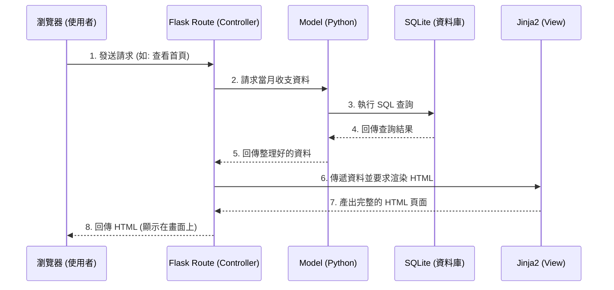

# 系統架構設計：個人記帳本

## 1. 技術架構說明

本專案採用經典的 Web 後端渲染架構，所有的頁面邏輯、資料處理與 HTML 畫面生成都在後端（Server-side）完成，無需前後端分離，非常適合快速開發與小型專案。

- **選用技術與原因**：
  - **Python + Flask**：輕量級的後端框架，學習曲線平緩，非常適合用來建立小巧但五臟俱全的個人記帳本。
  - **Jinja2**：Flask 內建的模板引擎。透過它，我們可以在 HTML 中直接嵌入 Python 變數與控制邏輯（如迴圈、條件判斷），讓後端資料能夠輕鬆呈現在網頁上。
  - **SQLite**：輕量級關聯式資料庫。它不需要額外安裝伺服器，資料會直接儲存為單一檔案，非常適合個人記帳本的輕量化與可攜帶需求。

- **Flask MVC 模式說明**：
  雖然 Flask 原生沒有強制 MVC（Model-View-Controller）架構，但為了讓程式碼好維護，我們將採用類似 MVC 的設計：
  - **Model (模型)**：負責與 SQLite 資料庫溝通，定義資料表結構（如：收支紀錄、類別等），處理資料的存取與驗證。
  - **View (視圖)**：負責呈現使用者介面。在這個架構下，是由 HTML 檔案與 `Jinja2` 模板負責，將 Controller 傳來的資料轉化為使用者看得到的網頁。
  - **Controller (控制器)**：由 `Flask 路由 (Routes)` 擔任。它負責接收瀏覽器的請求（如：使用者按下「新增記帳」按鈕），向 Model 獲取或更新資料，最後將資料傳遞給 View 來產生網頁。

## 2. 專案資料夾結構

以下是本專案的目錄結構與每個資料夾/檔案的具體用途：

```text
web_app_development/
├── app/
│   ├── __init__.py      ← 初始化 Flask 應用程式的工廠函數 (App Factory)
│   ├── models.py        ← 資料庫模型 (定義收支紀錄等 SQLite 資料表)
│   ├── routes.py        ← Flask 路由 (Controller)，處理所有的 URL 請求
│   ├── templates/       ← Jinja2 HTML 模板 (View)
│   │   ├── base.html    ← 共用的網頁版型 (包含導覽列等)
│   │   ├── index.html   ← 首頁 (當月收支總覽與新增表單)
│   │   └── history.html ← 歷史收支明細列表頁面
│   └── static/          ← 靜態資源 (CSS、JavaScript、圖片等)
│       └── style.css    ← 專案主要的樣式表
├── instance/
│   └── database.db      ← SQLite 資料庫檔案 (系統自動產生，儲存所有記帳資料)
├── docs/
│   ├── PRD.md           ← 產品需求文件
│   └── ARCHITECTURE.md  ← 系統架構文件 (即本文件)
├── app.py               ← 專案的主要入口點，用來啟動開發伺服器
└── requirements.txt     ← 記錄專案需要安裝的 Python 套件與版本
```

## 3. 元件關係圖

以下展示當使用者透過瀏覽器操作時，系統內部的資料流與元件互動情形：



## 4. 關鍵設計決策

1. **不採用前後端分離架構**：
   - **原因**：為了簡化開發流程與降低專案複雜度。記帳本屬於重度依賴表單提交與列表展示的系統，使用 Flask 搭配 Jinja2 傳統的 Server-side Rendering (SSR) 可以用最少的程式碼快速達成目標，不需要額外維護 React/Vue 等前端專案與 API 介面。
2. **採用單一檔案的 SQLite 資料庫**：
   - **原因**：個人記帳本資料量小且並行寫入需求極低。使用 SQLite 免去了配置 MySQL/PostgreSQL 伺服器的麻煩，資料庫以單一檔案 (`instance/database.db`) 的形式存在，備份或轉移都非常容易。
3. **將路由、模型與模板獨立分層 (MVC 結構)**：
   - **原因**：即便 Flask 允許將所有程式碼寫在同一個 `app.py` 中，但我們選擇將路由邏輯 (`routes.py`)、資料邏輯 (`models.py`) 與畫面 (`templates/`) 拆分。這樣做不僅有助於初學者理解職責分離，後續要增加新功能時，程式碼也更容易維護與擴充。
