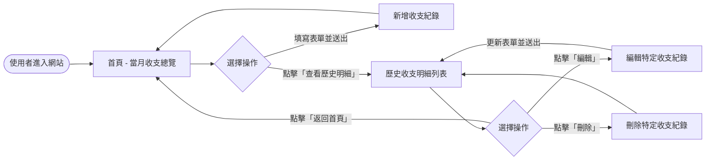
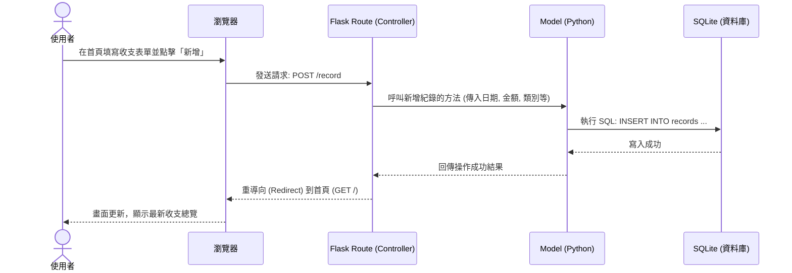

# 流程圖：個人記帳本

這份文件描述了「個人記帳本」系統的使用者操作流程、核心功能的系統運作邏輯，以及各功能與對應 URL 的對照表。

## 1. 使用者流程圖（User Flow）

此流程圖展示了使用者進入系統後，可以進行的各種操作路徑，包含新增紀錄、查看明細，以及編輯與刪除。

## 2. 系統序列圖（Sequence Diagram）

此序列圖描述了核心功能「使用者新增單筆收支紀錄」時，系統背後各個元件（瀏覽器、Flask、Model、SQLite）的資料流動過程。

## 3. 功能清單與路由對照表

下表列出系統主要功能對應的 URL 路徑與 HTTP 請求方法，提供後端開發路由時參考：

| 功能名稱 | URL 路徑 | HTTP 方法 | 說明 |
| --- | --- | --- | --- |
| 首頁 (當月總覽與新增) | `/` | GET | 顯示當月總收入、支出、結餘，並提供新增收支表單 |
| 新增收支紀錄 | `/record` | POST | 接收首頁表單的資料，驗證後存入資料庫 |
| 查看歷史明細 | `/history` | GET | 以列表形式顯示過往的所有收支紀錄 |
| 顯示編輯表單 | `/record/<id>/edit` | GET | 根據紀錄 ID，顯示該筆紀錄的編輯表單頁面 |
| 更新收支紀錄 | `/record/<id>/edit` | POST | 接收編輯後的資料，更新資料庫並返回明細頁 |
| 刪除收支紀錄 | `/record/<id>/delete`| POST | 根據紀錄 ID 刪除對應的資料，執行後返回明細頁 |
