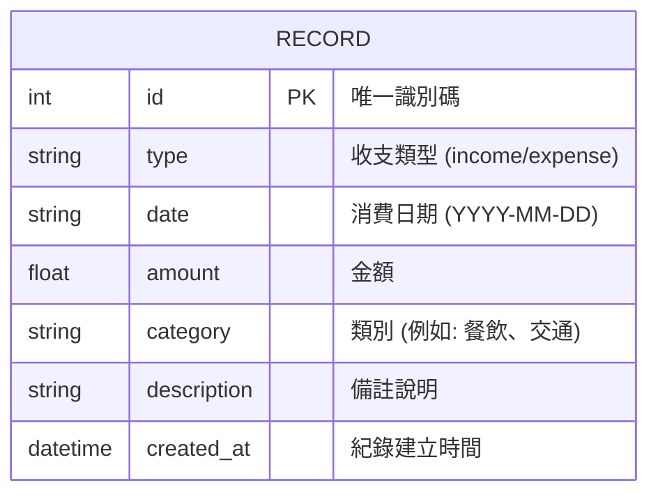

# 資料庫設計：個人記帳本

這份文件描述了系統底層 SQLite 資料庫的設計，包含實體關係圖 (ER 圖)、資料表詳細欄位說明，以及建表語法的位置。

## 1. ER 圖（實體關係圖）

目前系統為了保持輕量化並符合 MVP 需求，主要由單一資料表 `RECORD` 來儲存所有的收支紀錄。類別暫時以文字形式直接儲存於紀錄中。

## 2. 資料表詳細說明

### `record` 資料表

用來儲存使用者的每一筆收入與支出紀錄。

| 欄位名稱 | 型別 | 必填 | 預設值 | 說明 |
| --- | --- | --- | --- | --- |
| `id` | INTEGER | 是 | (Auto Increment) | Primary Key (主鍵)，系統自動遞增。 |
| `type` | TEXT | 是 | 無 | 標示此筆紀錄為收入或支出，限制值應為 `'income'` 或 `'expense'`。 |
| `date` | TEXT | 是 | 無 | 該筆收支發生的日期，使用 ISO 8601 格式儲存（如 `2026-04-27`）。 |
| `amount` | REAL | 是 | 無 | 收支金額。使用 REAL 型別以支援小數點（若有需要），或可存為整數。 |
| `category` | TEXT | 是 | 無 | 該筆收支的分類，例如「餐飲」、「交通」、「薪資」等。 |
| `description` | TEXT | 否 | `NULL` | 使用者對該筆收支的額外備註。 |
| `created_at` | TEXT | 是 | `CURRENT_TIMESTAMP` | 該筆資料寫入系統的時間戳記。 |

## 3. SQL 建表語法

請參考 `database/schema.sql` 檔案中完整的 SQLite `CREATE TABLE` 語法。

## 4. Python Model 程式碼

我們使用內建的 `sqlite3` 模組來實作 Model。相關的 CRUD (Create, Read, Update, Delete) 操作已封裝於 `app/models/record.py` 中的 `RecordModel` 類別裡。
